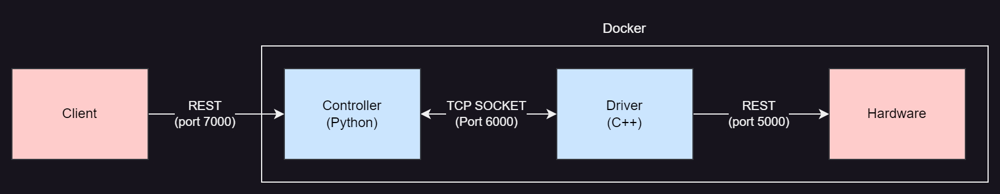
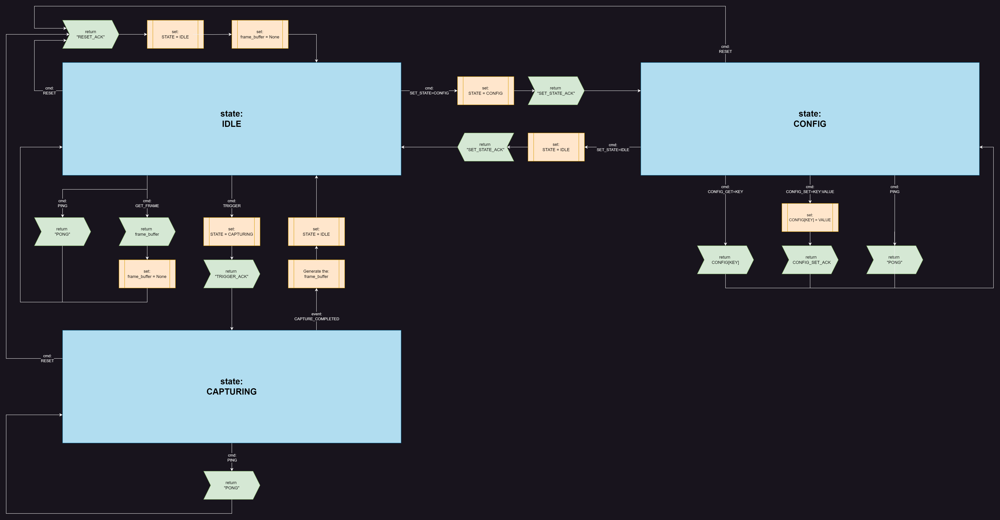
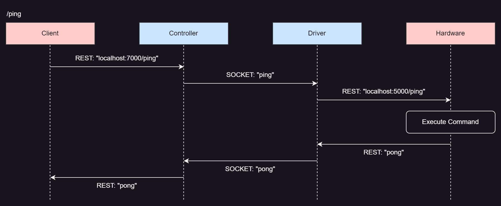
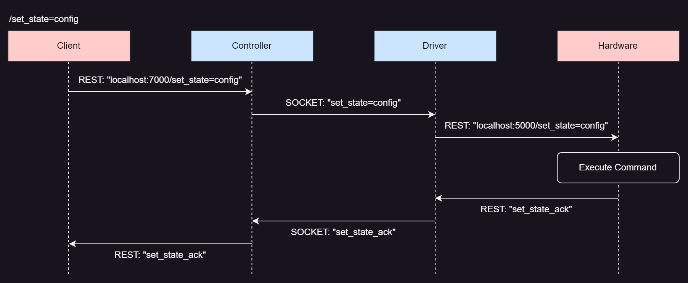
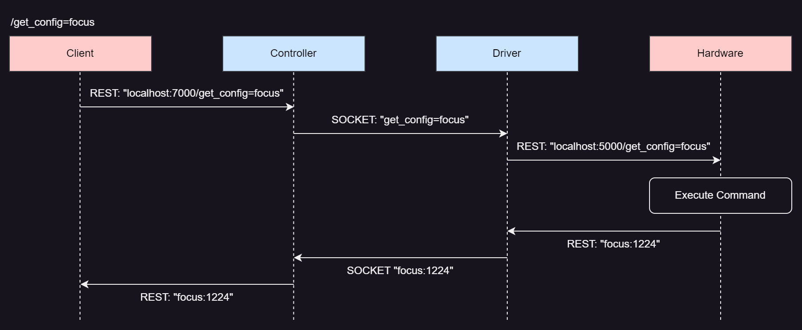

# Embedded Engineer take-home test for Overview.ai

## Overview

This project is a simulation of a real-world application where the main logic ***(Controller)*** needs to communicate with the **Hardware** through a **Driver**. In total, there are 3 Docker containers:
- `hardware`
    - Emulates the hardware of an AI Industrial Inspection Camera.
- `driver`
    - Lower level logic written in C++.
- `controller`
    - Higher level logic written in Python.

Architecture:

### Hardware
The **Hardware** container emulates an AI Industrial Inspection Camera. It serves a REST API (port 5000), and receives commands from the Driver as GET requests over that API.

#### API Endpoints

The available endpoints are:
 - `/ping`
    - Description: Acts as a 'healthcheck' endpoint *(works in any state and any mode)*.
    - Returns:
        - `pong`
 - `/trigger`
    - Description: Initiates the capturing process, putting the **Hardware** in `capturing` state *(only allowed if the **Hardware** is in the `idle` state)*
    - Returns:
        - `trigger_ack`: If the trigger is acknowledged.
        - `trigger_err`: If there is an error during triggering.
 - `/get_frame`
    - Description: This endpoint returns the image frame buffer data *(The frame buffer is cleared right after this endpoint is called. Only one valid call to `/get_frame` can be made per capture.)*.
    - Returns:
        - `{HEX_IMAGE_DATA}`: A string of random hexadecimal chars to simulate the data of an image.
        - `get_frame_err`: If there is an error trying to get the image frame data or if the same is empty.
 - `/get_state`
    - Description: Get the current **Hardware** state *(`idle`, `config`, `capturing`)*.
    - Returns:
        - `state:{STATE}`
 - `/set_state={STATE}`
    - Description: Set the **Hardware** state *(`idle`, `config`. The `capturing` state can not be set manually)*.
    - Examples:
        - `/set_state=idle`
        - `/set_state=config`
    - Returns:
        - `set_state_ack`
 - `/get_config={PARAMETER}`
    - Description: Get the value for a certain configuration PARAMETER.
    - Examples:
        - `/get_config=exposure`
        - `/get_config=led_pattern`
    - Returns:
        - `{PARAMETER}:{VALUE}`
 - `/set_config={PARAMETER}:{VALUE}`
    - Description: Set the value for a certain configuration PARAMETER.
    - Examples:
        - `/set_config=focus:800`
        - `/set_config=photometric_mode:1`
    - Returns:
        - `set_config_ack`
 - `/reset`
    - Description: Resets the **Hardware** *(useful when the camera freezes or gets stuck, works in any state and any mode)*.
    - Returns:
        - `reset_ack`

#### States

The **Hardware** has some state machine logic behind it, shown in the diagram below:

There are three valid states:
- State: `idle`
    - Allowed commands:
        - `/ping`
        - `/trigger`
        - `/get_frame`
        - `/get_state`
        - `/set_state`
        - `/reset`

- State: `config`
    - Allowed commands:
        - `/ping`
        - `/get_state`
        - `/set_state`
        - `/get_config`
        - `/set_config`
        - `/reset`
- State: `capturing`
    - Allowed commands:
        - `/ping`
        - `/get_state`
        - `/reset`

*Observations:*
- *The **Hardware** can not be put in a `capturing` state using the `/set_state` command.*
- *The **Hardware** can only accept `/trigger` and `/get_frame` commands when in an `idle` state.*

#### Triggering a capture

When the **Hardware** receives a `/trigger` command it either:
    - Enters a `capturing` state and returns `trigger_ack`
    - Remains in the same state and returns `trigger_err`

After the trigger is acknowledged the **Hardware** starts taking the capture, after some time *(between 1.0s and 4.5s)*, the image frame buffer hex data will be available to be read by the **Driver** with a `/get_frame` command.

After the image frame buffer is read, its data will be cleared and trying to send a `/get_frame` command again will return a `get_frame_err`.

#### Modes

The **Hardware** has two available modes which are called `photometric_mode`, depending on the type of inspection, the user might prefer it **on** or **off**. 

The `photometric_mode` can be changed with the `/set_config=photometric_mode:{VALUE}` command:
- Ex.: `/set_config=photometric_mode:0`
- Ex.: `/set_config=photometric_mode:1`

The value of this mode impacts in the **Hardware** performance in the following manners:

- `photometric_mode:0`
    - Expected inspection time is between 2.0s and 3.0s *(time between the trigger being acknowledged and the image frame buffer becoming available)*
- `photometric_mode:1`
    - Expected inspection time is between 3.5s and 4.5s *(time between the trigger being acknowledged and the image frame buffer becoming available)*

The `photometric_mode` and `led_pattern` have some interdependencies:
- `photometric_mode` can only be turned **on** *(1)* if `led_pattern:a` ***(ALL OFF)***.
- `led_pattern` can only be changed when `photometric_mode:0` ***(off)***.

#### Configuration
The **Hardware** has several different configurations parameters that can be read *(get_config={KEY})* and written *(set_config={KEY}:{VALUE})* via commands sent to the REST API.

Configuration parameters can only be read and written when the **Hardware** is in the `config` state.

The following configuration parameters are available:

- `focus`
    - An integer between 0 and 1600.
        - Ex.: 1224
- `exposure`
    - A one decimal floating point between 0 and 1000.
        - Ex.: 458.5
- `gain`
    - A signed integer between -12 and +12 *(It must start with a + or - sign)*.
        - Ex.: -8
        - Ex.: +10
- `led_pattern`
    - One of the following options:
        - `a`: *(ALL OFF)*
        - `b`: *(ALL ON)*
        - `c`: *(LEFT)*
        - `d`: *(RIGHT)*
        - `e`: *(LEFT + RIGHT)*
        - `f`: *(TOP)*
        - `g`: *(BOTTOM)*
        - `h`: *(ALL ONTOP + BOTTOM)*
- `led_intensity`
    - An integer between 0 and 255.
- `photometric_mode`
    - One of the following options:
        - `0`: *(off)*
        - `1`: *(on)*

Here are some examples:
- Get `focus` value:
    - `/set_state=config`
    - `/get_config=focus`
    - `/set_state=idle`
- Set `gain` and `exposure` values:
    - `/set_state=config`
    - `/set_config=gain:+5`
    - `/set_config=exposure:458.5`
    - `/set_state=idle`

#### Behavior
The **Hardware** container is programmed to simulate some real-life challenges that are faced with real hardware, like:
- Timeouts
- Freezes
- Corrupted data
- Unexpected data

The **Hardware** does not perform any data or logic validation, receiving invalid data or illegal commands will result in timeouts and freezes.

### Driver
The **Driver** receives a string message from the **Controller** in the socket connection *(port 6000)*, forwards it as a **GET** request to the **Hardware**, waits for the request's response and returns it to the **Controller** over the same socket connection.

### Controller
The **Controller** is the high level logic, it serves a REST API to the **Client** *(port 7000)* and communicates with the **Driver** over a socket connection *(port 6000)*.

The **Controller** should expose the same API Endpoints that the **Hardware** does:
 - `/ping`
 - `/trigger`
 - `/get_frame`
 - `/get_state`
 - `/set_state={STATE}`
 - `/get_config={PARAMETER}`
 - `/set_config={PARAMETER}:{VALUE}`
 - `/reset`

*Observation: To simplify the code for the test, the **Controller** has only one purpose in this case, to forward the REST API requests from the **Client** over a socket connection to the **Driver**, wait for a response and return it back to the **Client**. In a real-world scenario this code would include more functionality, like connecting to a DB, running AI models, etc.*

### Example flows

## Task
Your task involves improving the **Driver** *(firstly)* and the **Controller** *(secondly)* in the following manners:
- Handle timeout *(see the **[Timeouts](#timeouts)** section)* and freezes caused by the **Hardware**.
    - Ex.: If the **Hardware** takes longer than `100ms` to reply to a `ping` command from the **Driver**, the **Driver** could retry the command if possible or return an error to the **Controller**.
- Prevent the **Controller** from performing illegal operations:
    - Ex.: If the **Hardware** is on `photometric_mode:1` and the **Controller** sends `set_config=led_pattern:b` to it, the **Driver** should not forward this to the **Hardware** and return an error to the **Controller**.
- Prevent the **Controller** from sending invalid data:
    - Ex.: If the **Controller** sends `set_config=gain:100` to the **Driver**, it should reject the command, as `100` is not a valid value for the `gain` configuration parameter.
- Find out edge cases and handle them.
- Handle corrupted/unexpected data.
- Keep track of the **Hardware** state.

### Timeouts
This is a list of the maximum amount of time the **Driver** should wait for a response from the **Hardware**. The **Driver** should somehow handle the cases where the **Hardware** does not reply within this amount of time, for example retrying the request if possible or returning an error to the **Controller** as soon as the maximum amount of time is reached.

- `/ping`, `/trigger`, `/get_frame`, `/get_state`, `/set_state={STATE}`, `/get_config={PARAMETER}`, `/set_config={PARAMETER}:{VALUE}`.
    - 150ms.
- `/reset`.
    - 2000ms.
- Time between a `trigger_ack` and the **image frame buffer** becoming availabe:
    - Between 1000ms and 4500ms depending on `photometric_mode`.

### Constraints
- You can only modify the files in the directories for the **Driver** and **Controller** containers, the **Hardware** directory should remain untouched.

### Bonus points
- Performance, stability, reliability and resource usage improvements.
- Keeping track of performance *(Log/Plot statistics)*.
- Refactoring the code to make it more readable.
- Implementing more features.

## Prerequisites
- `docker`
- `docker-compose`

## Quick Start
Run `docker-compose up --build` on the terminal to build the containers.

There is a Python script called `usage_example.py` in the root.

You can also use `curl` to test the endpoints *(Both on the **Hardware** and on the **Controller**)*:
- Ex.: `curl http://localhost:5000/ping`
- Ex.: `curl http://localhost:7000/ping`

## Evaluation Criteria
- 70% of the score will come from the **Driver** *(C++)* code.
- Completeness of the required features.
- Code readability and structure.
- Identifying edge cases.
- Proper error handling.
- State management.
- Creativity.

## Delivery
1. **Repository**:
   - Create a **private** GitHub repository for the project.
   - Add Adriano (@opassos) and Xiao (@xyk2) as collaborators.

2. **Video Demo**:
   - Record a video demonstrating your solution (2 to 5 minutes). Showcase the application's functionality, focusing on the implemented key features and bonus points.
   - Upload the video to a streaming service (e.g., YouTube) as an **unlisted** video.

3. **Submission**:
   - Provide the GitHub repository link and video link.
   - Ensure your repository includes all necessary files for running the project locally.

Good luck!